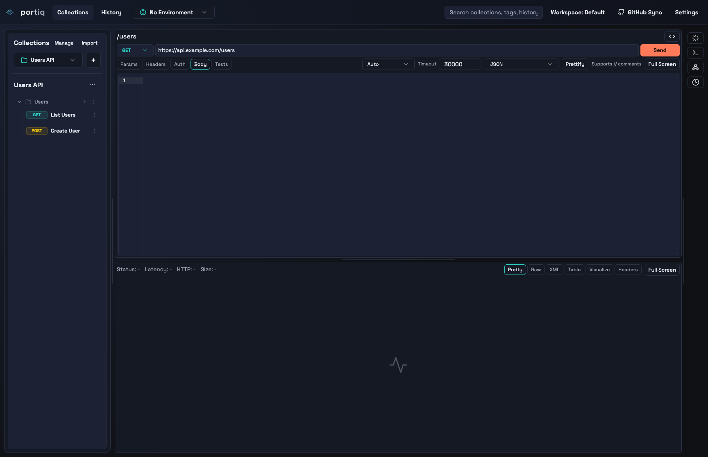
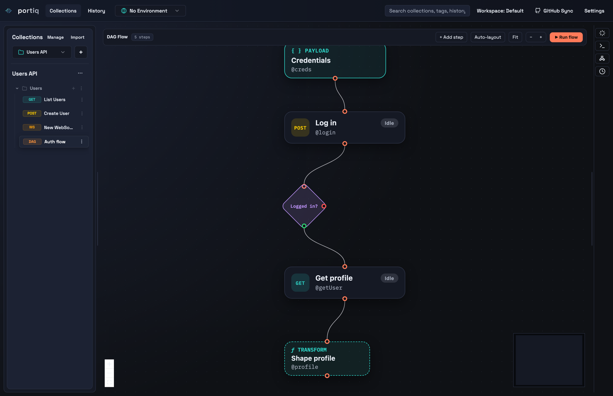
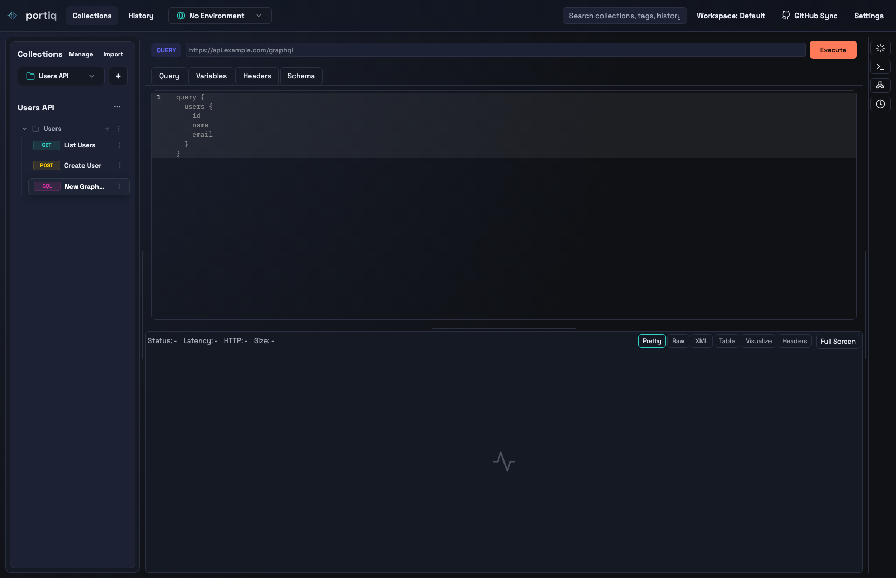
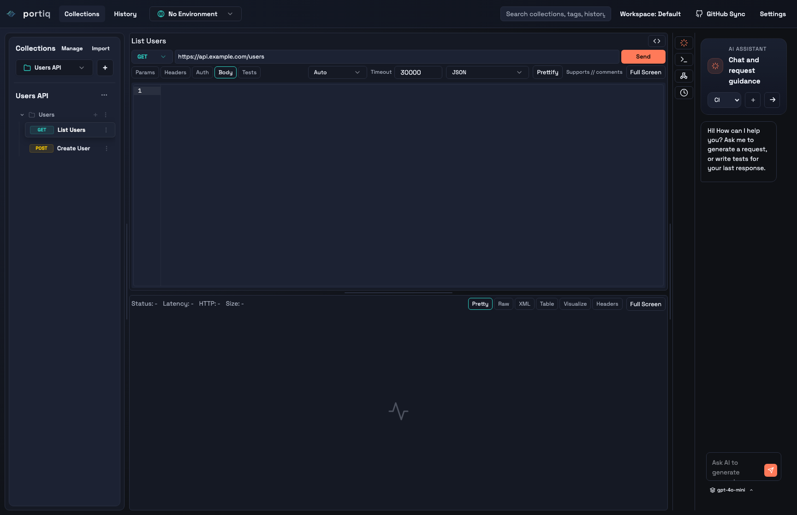

<p align="center">
  
</p>

<h1 align="center">Portiq</h1>

<p align="center"><b>The modern, AI-powered API client.</b></p>

<p align="center">
  Open-source, local-first desktop API client for HTTP, GraphQL, WebSocket, DAG flows, and more —<br/>
  with built-in AI assistance and Git-based sync. No account. No backend. Your data stays on your machine.
</p>

<p align="center">
  <a href="LICENSE"></a>
  
  
  
  
</p>

<p align="center">
  
</p>

## ✨ Highlights

|   |   |   |
| --- | --- | --- |
| 🌐 **Multi-protocol**<br/>HTTP, GraphQL, WebSocket, SSE, gRPC, MCP | 🔗 **DAG flows**<br/>Visual multi-step chaining with reference-based data passing | 🤖 **AI-assisted**<br/>Generate requests, tests & response summaries |
| 🗂️ **Collections**<br/>Nested folders, history, workspaces | 🌱 **Environments**<br/>`{{variable}}` interpolation everywhere | 🔍 **Response tools**<br/>Pretty / table / visualize, CSV & JSON export |
| 🔐 **Git-based sync**<br/>Sync to a private GitHub repo, no backend | 🧪 **Scripts & tests**<br/>Pre/post scripts, `pm.*` helpers | 💾 **Local-first**<br/>SQLite persistence, data stays on your machine |

## 🚀 Quick Start

```bash
npm install
npm run dev
```

If you use Nix:

```bash
nix-shell -p nodejs_20 --run "npm install"
nix-shell -p nodejs_20 --run "npm run dev"
```

If native modules need a rebuild:

```bash
npm run rebuild
```

## 📸 Screenshots

<p align="center">
  
  
</p>
<p align="center">
  
</p>

## 🔌 Protocol Support

Portiq is multi-protocol, but not every protocol has the same maturity yet.

| Protocol | Status | Notes |
| --- | --- | --- |
| HTTP / REST | Stable | Full request editor, auth, body modes, timeout, cancel, response tools |
| GraphQL | Stable for queries and mutations | Variables, schema fetch, HTTP execution, shared response tools |
| WebSocket | Stable | Persistent connections, headers, subprotocols, timeout, reconnect, message viewer |
| SSE / Socket | Available | Stream viewer support |
| Mock Server | Available | Local mock server configuration and route generation |
| DAG Flow | Available | Visual multi-step flow editor with reference-based data passing and payload injection |
| MCP | Available | MCP server connection and prompt/resource browsing |
| gRPC | Experimental | UI exists, native transport is not fully enabled yet |

> **Notes**
> - GraphQL subscriptions are not yet handled as a first-class GraphQL-over-WebSocket flow inside the GraphQL pane.
> - gRPC currently needs additional native transport work before it should be treated as production-ready.

## 🧩 Features

<details>
<summary><b>Request Building</b></summary>

Portiq supports day-to-day API request authoring with a desktop-first editor layout.

**HTTP request capabilities**

- Methods: `GET`, `POST`, `PATCH`, `PUT`, `DELETE`, `HEAD`, `OPTIONS`
- HTTP versions: `Auto`, `HTTP/1.1`, `HTTP/2`
- Per-request timeout
- Request cancel while in flight
- Query params editor with enable/disable controls
- Headers editor in `Table` or `JSON` mode
- Auth editor with structured fields
- Request templates in the request bar

**Body modes**

- `none`
- `json`
- `xml`
- `raw`
- `x-www-form-urlencoded`
- `form-data`

**JSON editing quality-of-life**

- comment-tolerant JSON editing
- prettify support
- linting and validation before send
- environment interpolation support
- CodeMirror-based editing with search

**WebSocket request capabilities**

- connection URL and connect/disconnect flow
- connection timeout
- auto-reconnect
- handshake headers
- subprotocols
- message composer for `Text`, `JSON`, and `Binary`
- WebSocket message response panel with sent/received filtering

**GraphQL request capabilities**

- query editor
- variables editor
- operation name
- schema fetch
- schema browsing
- shared response viewer

</details>

<details>
<summary><b>Collections, Workspaces, and History</b></summary>

Portiq is designed around reusable request organization, not one-off tabs only.

- collections with nested folders
- request tree grouped inside collections
- inline request and folder rename flows
- per-request protocol identity in the sidebar
- current request loading directly from the collection tree
- history tracking with persisted entries
- workspace-aware layout and app state persistence

</details>

<details>
<summary><b>Environments and Variables</b></summary>

Environments help you move between local, staging, and production configurations.

- multiple named environments
- active environment selection
- key/value variable editor
- enable or disable individual variables
- `{{variable}}` interpolation in:
  - URL
  - params
  - headers
  - auth inputs
  - request body
  - WebSocket message bodies
- environment management modal for create, edit, and delete flows

</details>

<details>
<summary><b>Response Inspection and Data Tools</b></summary>

Portiq includes several ways to inspect the same response without switching tools.

**Response views**

- Pretty JSON
- Raw
- XML
- Table
- Visualize
- Headers
- Full Screen

**Table tools**

- load table data from a detected or manually entered JSON path
- wildcard path support such as `$.items[*].children`
- search across all keys or a specific key
- sort by column
- export as CSV or JSON
- derived fields
- hover errors for failed derived fields

**Data transforms**

- JSON to XML
- JSON to CSV
- JSON object and array normalization for table view

</details>

<details>
<summary><b>Scripts and Tests</b></summary>

Portiq supports request lifecycle scripting and lightweight assertion workflows.

- pre-request scripts
- post-response scripts
- run scripts without hitting the API by using test input
- Postman-style `pm.*` helpers
- structured log output with type labels
- collapsible output drawer
- generated tests from AI assistance

Current scripting focus:

- useful for request shaping, checks, and exploratory testing
- not yet a complete Postman runtime replacement

</details>

<details>
<summary><b>AI Features</b></summary>

Portiq includes built-in AI helpers for request authoring and analysis.

- natural-language request generation
- AI-generated tests from a response
- response summarization and debugging hints
- provider support for:
  - OpenAI
  - Anthropic
  - Google Gemini
- semantic search with local embeddings

AI behavior is configurable in the in-app Settings modal (see **Settings** below).

</details>

<details>
<summary><b>Import and Export</b></summary>

Portiq supports moving request data in and out of the app.

**Import**

- from text
- from API URL
- from file
- from cURL

**Export**

- request/collection export flows
- CSV and JSON export from response tables

</details>

<details>
<summary><b>GitHub Sync</b></summary>

Portiq does not require a custom backend for sync. Instead, it can sync to a private GitHub repository named `portiq-sync`.

**What gets synced**

- collections
- folders
- requests
- environments
- app state
- history snapshots

**Sync layout**

Instead of writing everything into a single `state.json`, Portiq stores sync data in isolated files:

```text
workspace/
  manifest.json
  collections/
    <collection-name>__<collection-id>/
      collection.json
      root/
      <folder-path>/
        folder.json
        <request-id>.request.json
  history/
    YYYY-MM-DD/
      <collection-name>__<collection-id>/
        root/
        <folder-path>/
          <timestamp>-<request-id>.json
```

Why this structure is used:

- request-level conflicts stay isolated
- folder edits do not rewrite unrelated collections
- history is partitioned by date and request location
- repo contents remain inspectable and easy to recover manually

**GitHub sync behavior**

- device-code GitHub auth
- push local state to GitHub
- pull remote state into the app
- environment variable masking before push
- private repo workflow

> GitHub sync is file-based cloud sync, not a full custom backend with conflict resolution, user sessions, or multi-user collaboration rules.

</details>

<details>
<summary><b>Settings</b></summary>

All primary settings live in the in-app Settings modal.

**AI Configuration**

- AI provider selector
  - OpenAI
  - Anthropic
  - Google Gemini
- provider-specific API key input
- `Test Connection` button to validate the key and fetch supported models

**Preferences**

- `Enable AI Semantic Search`
  - uses local embeddings for semantic lookup
  - shows download/index progress when needed
  - if no download progress appears, the model is likely already cached locally
- `Enable AI request generation`
- `Enable response summaries`
- `Redact secrets before AI`
- `History Retention (Days)`

**Data Management**

- `Clear All App Data`
- `Show Data Location`

</details>

<details>
<summary><b>Local Storage and Data Paths</b></summary>

Portiq stores data locally on your machine.

- Electron app state is persisted in the app data directory
- SQLite is used for local persistence
- browser-compatible fallbacks are also used in some development paths

Typical app data locations:

- macOS: `~/Library/Application Support/Portiq/`
- Windows: `%APPDATA%/Portiq/`
- Linux: `~/.config/Portiq/`

You can also check the exact path from the app through `Settings -> Data Management -> Show Data Location`.

</details>

## 🛠️ Development

**Prerequisites**

- Node.js 20 or newer recommended
- npm

**Install and run**

```bash
npm install
npm run dev
```

If native module bindings mismatch on your machine, run `npm run rebuild`. If you use Nix, prefix commands with `nix-shell -p nodejs_20 --run "..."`.

<details>
<summary><b>Useful scripts</b></summary>

```bash
npm run dev            # run renderer + Electron in development
npm run dev:nix        # same, for Nix environments
npm run build          # build the renderer
npm run preview        # preview the built renderer
npm run lint           # lint the codebase
npm run rebuild        # rebuild native modules
npm run package        # package a desktop build
npm run package:desktop # package all desktop targets
npm run package:mac    # package macOS artifacts
npm run package:win    # package Windows artifacts
npm run package:linux  # package Linux artifacts
npm run package:release # package release artifacts without publishing
```

</details>

## 📦 Packaging and Release

<details>
<summary><b>Build, package, and release details</b></summary>

Build the renderer:

```bash
npm run build
```

Create desktop release artifacts:

```bash
npm run package
```

Platform-specific packaging scripts:

- macOS
  ```bash
  npm run package:mac
  ```
- Windows
  ```bash
  npm run package:win
  ```
- Linux
  ```bash
  npm run package:linux
  ```

Desktop artifacts currently configured:

- macOS: `dmg`, `zip`
- Windows: `nsis`, `portable`
- Linux: `AppImage`, `deb`, `rpm`

Build all desktop targets in one release command:

```bash
npm run package:desktop
```

Build release artifacts without publishing:

```bash
npm run package:release
```

GitHub release automation:

- tags matching `v*` trigger `.github/workflows/release.yml`
- the workflow builds platform artifacts on `macos-latest`, `windows-latest`, and `ubuntu-latest`
- generated installers are uploaded to the GitHub release automatically

Android note:

- Portiq is currently an Electron desktop app, so it does not produce an `apk` from this codebase.
- Releasing an Android build would require a separate mobile target, such as a React Native, Capacitor, or TWA-based app shell.
- See [docs/mobile-packaging-plan.md](docs/mobile-packaging-plan.md) for the recommended mobile path.

Build output is written to `release/`.

</details>

## 🗂️ Repository Structure

```text
src/
  components/
  hooks/
  protocols/
  services/
  utils/
electron/
docs/
```

Key areas:

- `src/App.tsx` - main app orchestration
- `src/components/RequestPane/` - request editing UI
- `src/components/ResponsePane/` - response rendering and table tools
- `src/components/ProtocolPanes/` - protocol-specific editors
- `src/services/` - AI, formatting, sync, mock server, and data helpers
- `src/protocols/` - protocol-specific request/response adapters
- `electron/` - Electron main and preload processes

## 🤝 Contributing

Contributions are welcome. Please read [CONTRIBUTING.md](CONTRIBUTING.md) and review [CODE_OF_CONDUCT.md](CODE_OF_CONDUCT.md).

When opening issues or pull requests, it helps a lot to include:

- protocol type
- exact reproduction steps
- request sample or import payload
- screenshot or screen recording for UI issues

## 📄 License

Portiq is released under the [MIT License](LICENSE).
